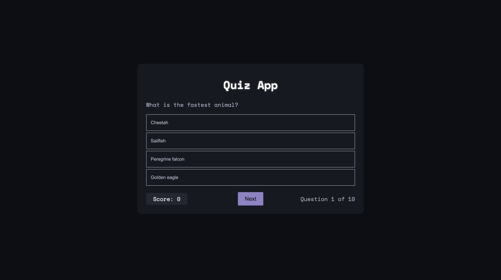

# Quiz App

An, interactive quiz web application built with HTNL, CSS and JavaScript. Users can answer multiple-choice questions, track their score, and restart the quiz at the end.

## Features
- Multiple-choice questions
- Score tracking
- Next question button with delay
- Simple quiz completion summary
- Option to retry quiz

##  Stacks Used 
- **HTML** – Structure of the quiz 
- **CSS** – Styling and layout 
- **JavaScript** – Quiz logic and interactivity

##  Live View 


##  How to Play 
1. Select an answer from the multiple-choice options. 
2. Click the **Next** button to proceed. 
3. Continue until the quiz ends. 
4. View your final score and restart the quiz if desired.

## Installation & Usage
1. Clone this repository:
   ```sh
   git clone https://github.com/VicTorQuest/quizApp.git
2. Open index.html in your browser

## Live Demo
https://victorquest.github.io/quizApp/